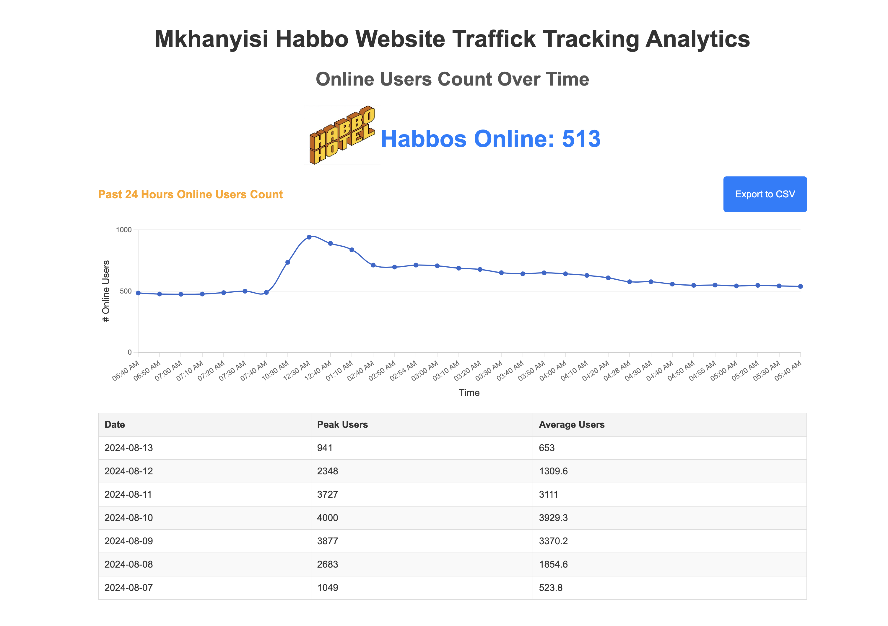

# RoMonitor Home Task - Game Analytics

## Overview

This project is a simple data collection and visualization tool built with Laravel (backend) and Vue.js (frontend). It fetches online user metrics from a third-party API, stores the data in an SQLite database, and provides a web interface for visualizing the data. Three metrics are on the page, currennt live user count, past 24 hours actual live users at timestamp and summary stats for past 7 days tracked data.



## Prerequisites

Ensure you have the following installed:

- [Docker](https://docs.docker.com/get-docker/)
- [Docker Compose](https://docs.docker.com/compose/install/)
- [Git](https://git-scm.com/book/en/v2/Getting-Started-Installing-Git)
- [Vue](https://vuejs.org/guide/quick-start)

## Installation

1. **Clone the Repository**

   ```
   bash git clone https://github.com/yourusername/your-repository.git
   cd your-repository
   ```

2. **Build and Start the Containers**
   ```
   docker-compose up --build
   ```
   This command builds the Docker images and starts the containers for both the Laravel backend, Vue frontend and the Cron Job chedule runner.

## Running the Application

1. **Access the Application**

- Frontend (Vue.js): http://localhost:5173
- Backend (Laravel API): http://localhost:8000

The Vue.js frontend will connect to the Laravel backend automatically.

2. **Scheduled Tasks**

The backend fetches data from the external API every 10 minutes. This is managed through Laravel's scheduler.

## Viewing the Homepage

Navigate to (http://localhost:80) to view the homepage. The page includes:

Header: Displays the site title and a live counter of online users.
Chart: A Highcharts line chart showing online user metrics for the past 24 hours with controls to view more data. Includes export functionality to CSV.
Table: Displays user metrics for up to 7 days with columns for Date, Peak Users, and Average Users.
